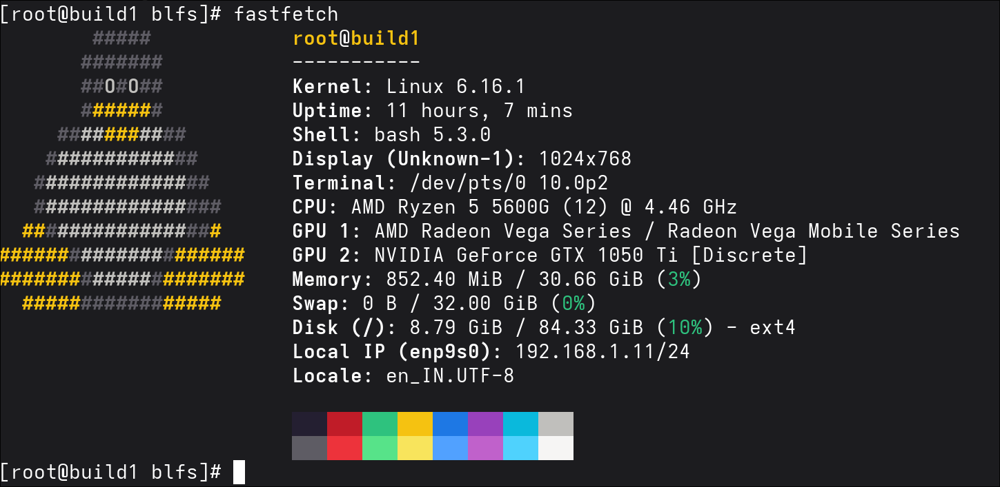

# Lets Build Linux from Scratch

## Current LFS Status

## Objective

This repo is indented to help users to setup Linux from scratch with minimal efforts.

## Builds

- build1

## Packages in installed order

- LFS base
- sshd
- wifi
- wget
- git
- pciutils
- usbutils
- which
- fastfetch

## Version

- LFS 12.4

## Thanks

- Tony [Youtube]
- The whole team behind LFS docs.

## Notes

- Skips Vim build tests, its froze my terminal.
- I would omit any sensitive data i used for the build.

## Last Updated

- 2025-11-29
- 2025-12-23
